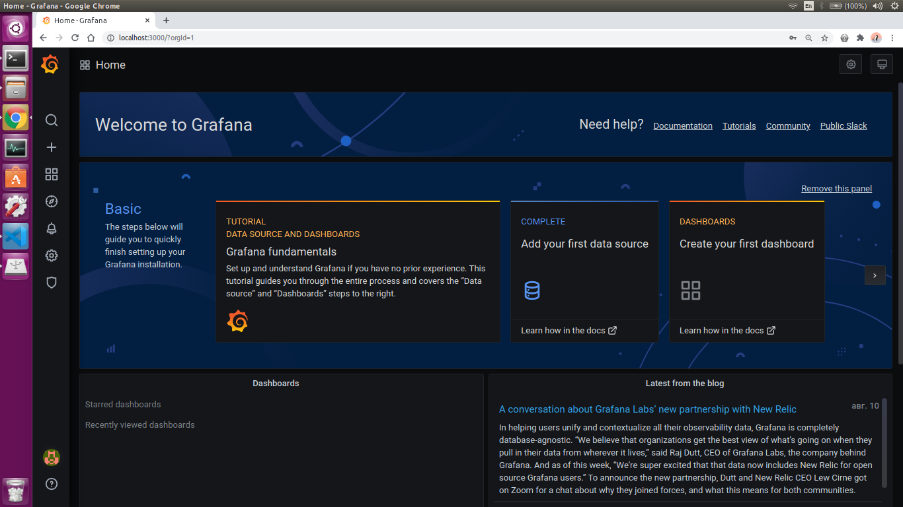
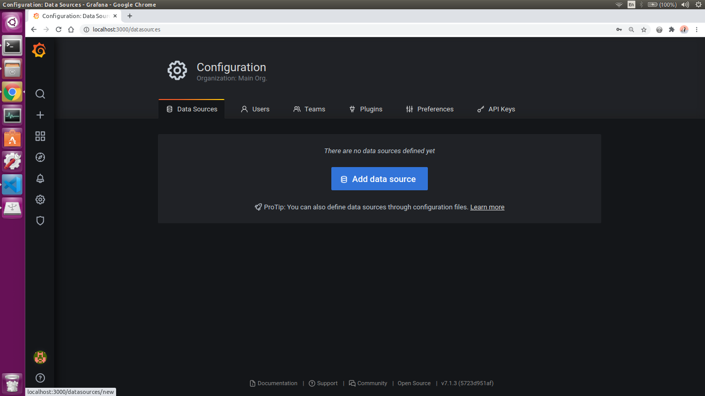
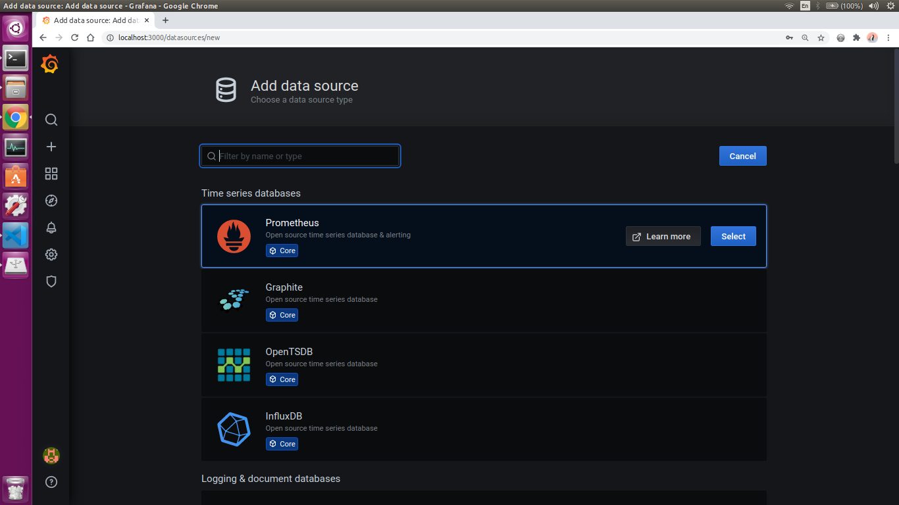
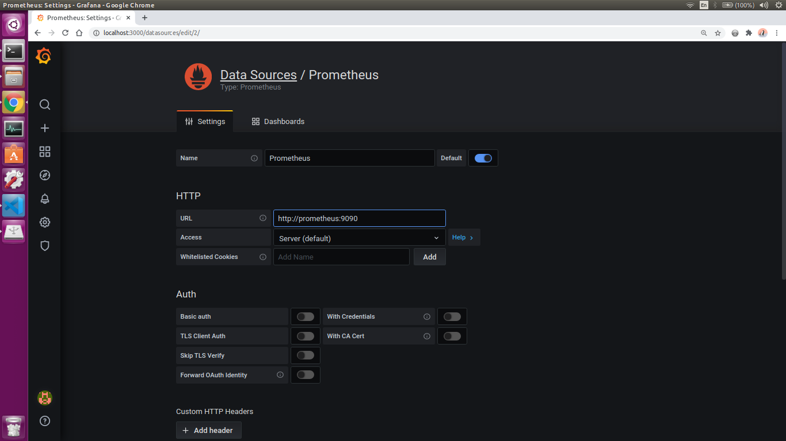
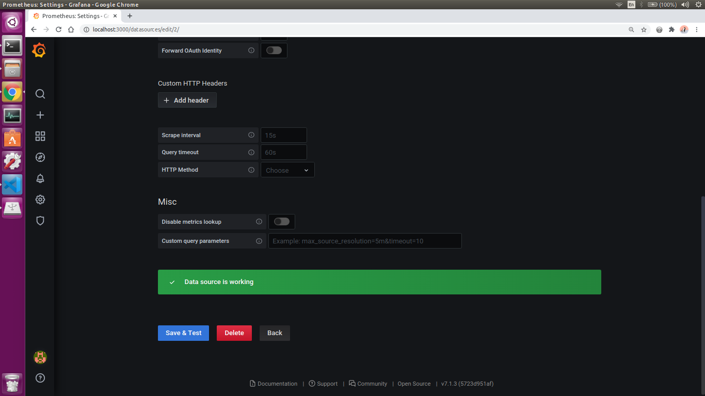
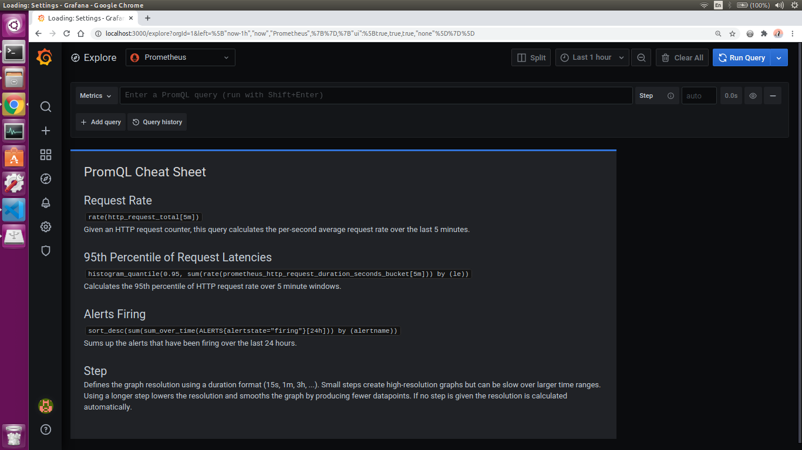
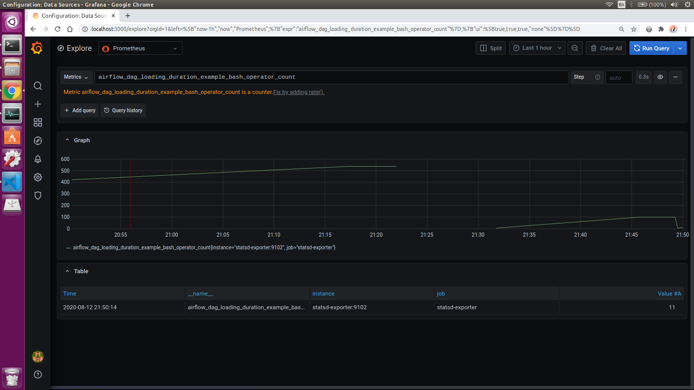

# Example of Prometheus with Airflow


## Build

```bash
docker-compose build
```


## Run

```bash
docker-compose up
```


## Working with services


### Open Airflow UI

```
http://localhost:8080
```


### StatsD exporter

Here you can overview metrics which statsd collects from Airflow.

```
http://localhost:9123/metrics
```

All Airflow metrics description: https://airflow.apache.org/docs/stable/metrics.html


### Prometheus UI

```
http://localhost:9090
```


### Grafana

Enter UI: ```http://localhost:3000```

Loging: `admin`

Password: `password`


### Connenct to Prometheus



1. go to `Configuration` -> `Datasources`;

2. click `Add data source`;

3. select `Prometheus`;
4. add `URL` = `http://prometheus:9090`;

5. click `Save and test`.



### Go to dashboard

Go to `Explore`.



Select airlfow metric.



